+++
title = "Movie Recommendation System"
slug = "Movie Recommendation System"
date = "2021-11-22"
+++

A recommendation system attempts to predict a user's preference or rating for an item. They are becoming increasingly important as people seek convenience and are always looking for products/services that are best suited to them. As a result, recommendation systems are important because they assist them in making the best decisions. The main goal of this mini project is to provide a personalized experience for each user by showing movies based on the movie of their choice and its imdb ratings.

This recommender system uses content-based filtering by implementing the K-Nearest Neighbors algorithm. This filtering method is typically based on collecting and analyzing information about a movie’s various details such as keywords, actors, genres, and predicting what the user will like based on the movie’s similarity to other movies. The main advantage of the content-based filtering approach is that the model doesn't need any data about other users since the recommendations are specific to this user. This makes it easier to scale to many users, so it can accurately recommend complex elements such as movies. Approaches such as collaborative filter algorithms face issues such as scalability, sparsity, and cold start, which can be avoided to some extent in the proposed framework.

**Methodology**

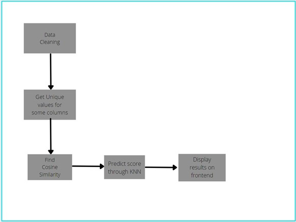

_Import the python libraries:_ 

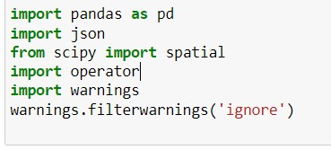

Here the main modules we work on are pandas and scipy. Pandas is a powerful tool used for data analysis and scipy is a library used to solve scientific and mathematical problems. Json is used initially while data cleaning and operator gives us some more math functions to work with.

_Import the dataset:_

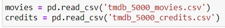

We import the datasets required to run the model. In this project we used ‘The movie data base’ which consists of 4000 different movie titles along with many other columns of attributes. We have decided to use 4 of attributes for the project; Genres, director and keywords from the movies file and cast from the credits file

_Cleaning the columns:_

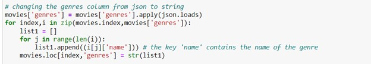

We convert the columns in json format to strings and write all the genres from the dataset into a list.

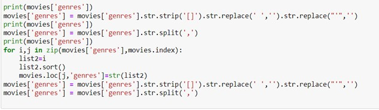

We now clean up the data we have. Above we can see that the genre column is being cleaned and sorted. Initially any leading or trailing square brackets are removed and subsequently and blank spaces or apostrophes in between the data is removed. The data is then put back into the genres column of the dataset.

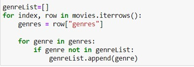

All unique genres in the dataset are then appended to a new list.

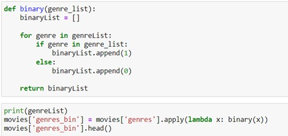

Here we create a new binary list, and if a genre is applicable to a certain movie a 1 is placed in the list, and a 0 if it is not applicable. We use the lambda function to go through the rows and apply the function binary to each movie. The result can be seen below.

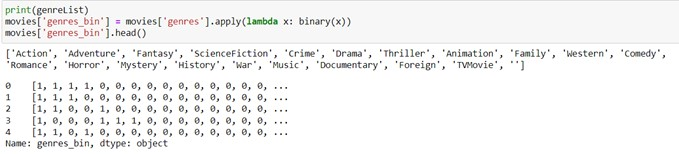

From the binary list that was created for all the rows we can see the assignment of genres. For example, for the movie with id 0, we can see that the genres Action, Adventure, Fantasy, Science Fiction are applicable. 

This process is repeated for each column until a satisfying number of attributes are achieved. In this project we clean and create 4 different binary lists similar to the one above.

_Finding similarity between movies:_

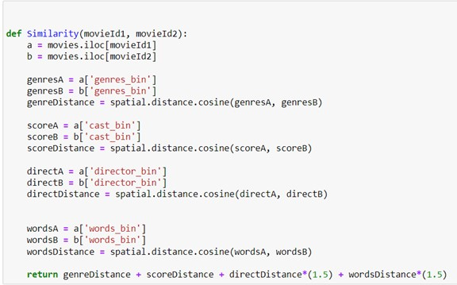

We write a function to compute the similarity between two movies using cosine similarity. The Cosine similarity measures the cosine of the angle between two vectors projected in space. It is helpful when plotted on a multi-dimensional space, where each dimension corresponds to a genre for example in this case. The output of the above code takes the cosine distance between two movies based on genre, cast, director and keywords.

_Predicting score and grouping movies:_

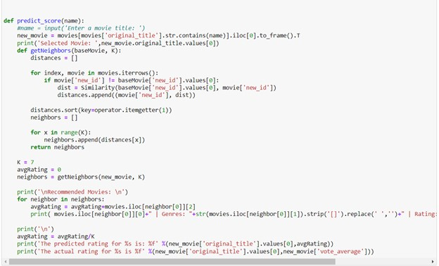

Finally, we have the function for predicting score which also finds the K nearest neighbors of the input movie. We took K = 7 for our program. After finding the nearest 7 neighbors based on cosine similarity, the average of the ratings is taken and displayed as the predicted rating of the input movie.

**Result**

We can see the output for the two movies, Avatar and Interstellar below.

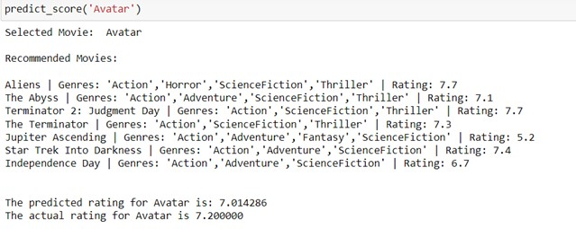

The result for interstellar using a front end using the Django framework

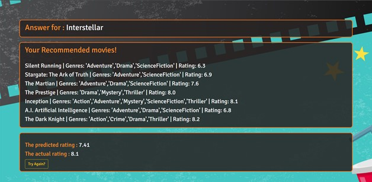

The results of the program are very satisfactory. From these 2 results we can see that the recommendations are quite accurate, giving results related to both the common genres as well as the directors. The predicted rating is also quite accurate, with an error around .3, and it can be rectified with further tweaks in the weightage given for each aspect of the movie.

