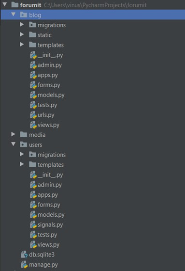
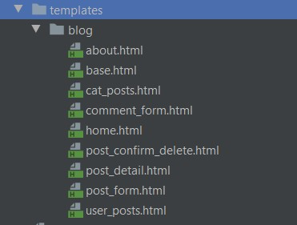
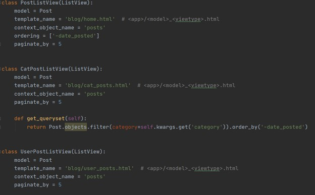
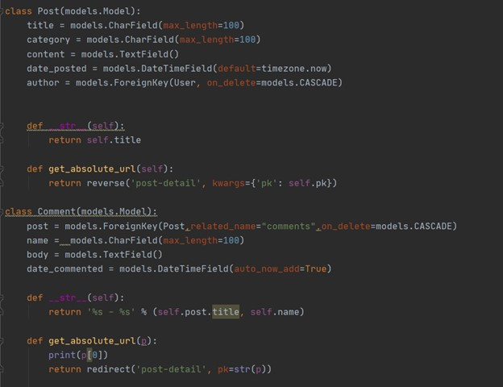
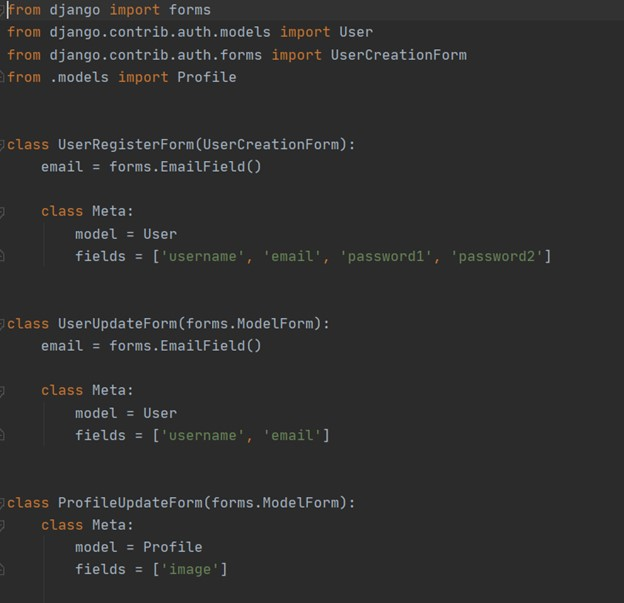
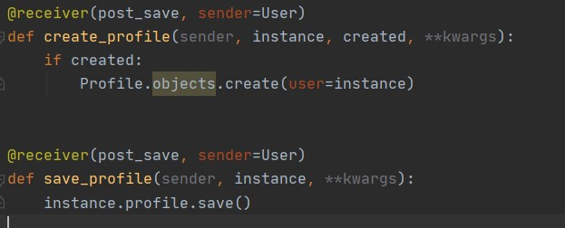
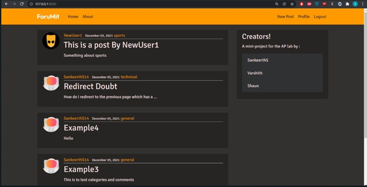
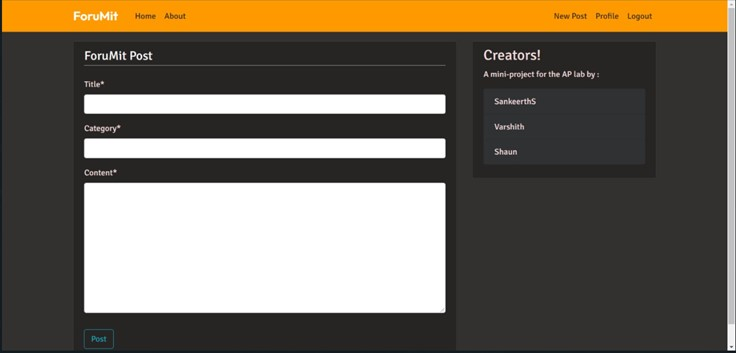
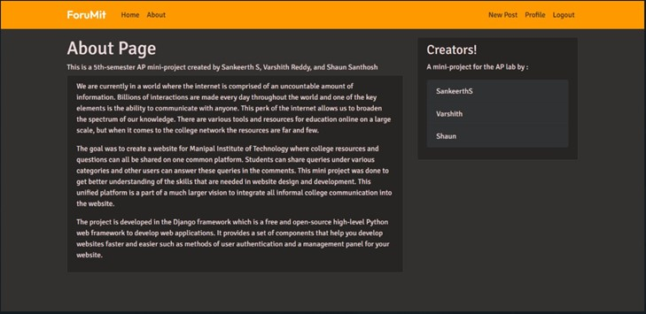
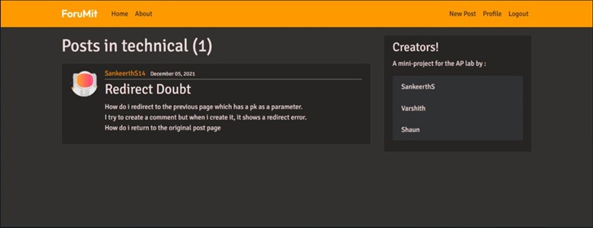

+++
title = "Website Using Django Framework"
slug = "Website using Django framework"
date = "2021-09-28"
+++

We are currently in a world where the internet is comprised of an uncountable amount of information. Billions of interactions are made every day throughout the world and one of the key elements is the ability to communicate with anyone. This perk of the internet allows us to broaden the spectrum of our knowledge. There are various tools and resources for education online on a large scale, but when it comes to the college network the resources are far and few. 
The goal was to create a website for Manipal Institute of Technology where college resources and questions can all be shared on one common platform. Students can share queries under various categories and other users can answer these queries in the comments. This mini project was done to get better understanding of the skills that are needed in website design and development. This unified platform is a part of a much larger vision to integrate all informal college communication into the website.
The project is developed in the Django framework which is a free and open-source high-level Python web framework to develop web applications. It provides a set of components that help you develop websites faster and easier such as methods of user authentication and a management panel for your website.

**Methodology and Implementation**

The project can roughly be represented by the tree given below.

Many of the files are created by default by Django and we will not be interfering with those. The few important files we work with are explained below.

_The templates folder:_

Here we have all the html code written for all the various pages on the website. 
Each .html file in here is a template. It consists of placeholders and works with the views.py and models.py files to fill these placeholders. These are known as block content represented by “”.

_Urls.py_:

the urls.py file is one of the first files we edit. It contains the various paths associated with the website and what action to take once a user is at a certain path. For instance, the path ‘about/’ will execute the view ‘views. about’. We will look at what exactly that does in the views.py file soon but most of the first contact happens with this file. If a path is not defined here, a page not found error is thrown. The ‘  ‘ path serves as the landing page.

_View.py:_

This is where the url.py path leads to. The landing page path  ‘  ‘  previously mentioned, referenced ‘PostListView’ given in this file. The code of the class PostListView is seen above. The template mentioned earlier is used here, and most of what is displayed on the screen is a result of this views page. The placeholder values mentioned in the templates are filled in by the model which is mentioned in the code. the contents of the model are given in the models.py file explained below.

_Models.py:_

This is where the database of the website comes into picture. The ‘Post’ model we use above creates 5 variables we will use for the Posts in the forum. Similarly, the ‘Comment’ model is for comments in the forum. All ‘Posts’ will have these 5 variables that will fill in the placeholders in the .html templates we mentioned before and can be accessed with Post. {variable name}. 

_Forms.py:_

Forms are a great way to input data into the website. We access the file ‘users/forms.py’ above. Here we can see various fields being created for the user to enter data into, for example, the ‘UserUpdateForm’ requires users to enter their username and email. The entered information is stored in the models we defined earlier.

_Signals.py:_

Signals allow senders to notify a set of receivers that some action has taken place. They’re very helpful when many pieces of code may be interested in the same events

**RESULTS**

The screenshots given below show the final output of the website and its various pages.

_Landing page (Home page):_

_Individual posts page:_

_Post creation page:_

_About page:_

_User creation page:_

_Category pages:_

